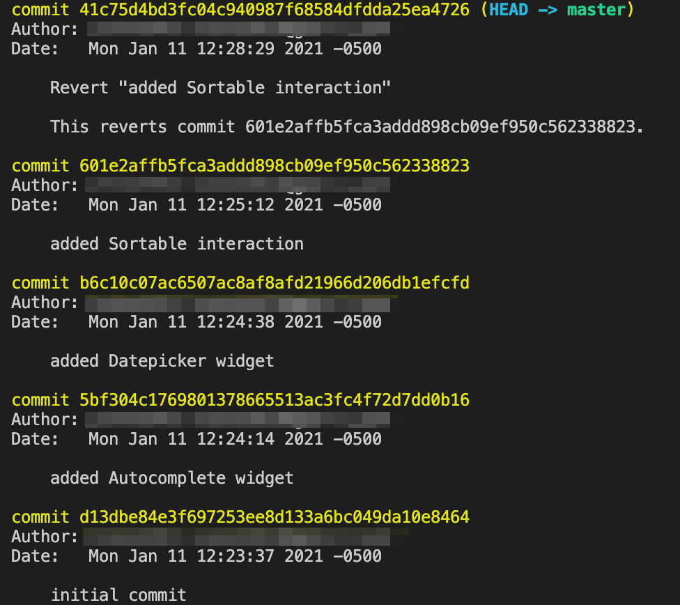
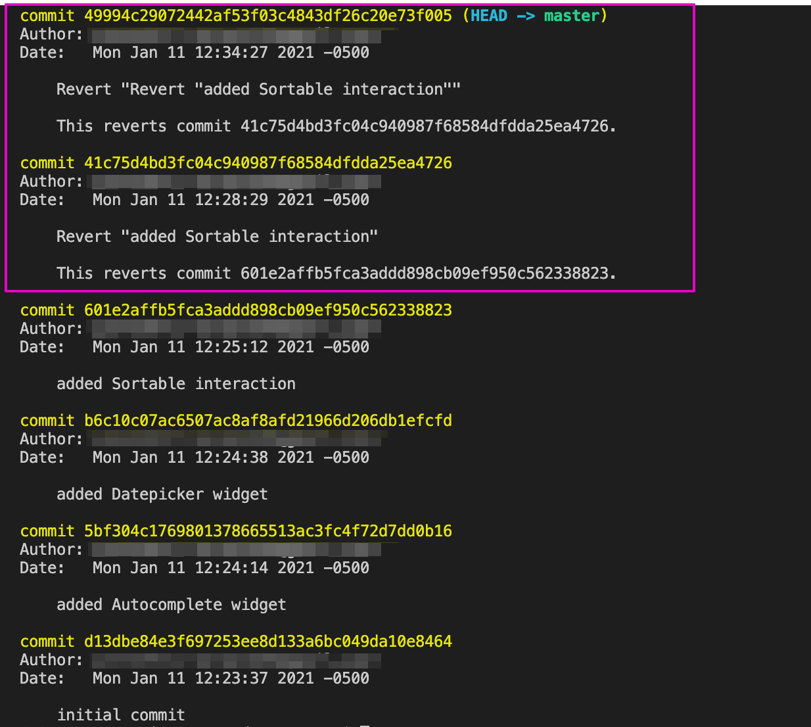

# Git Revert

In this activity, you will use `git revert` to undo a commit made earlier while keeping the commit history.

## Instructions

* In the command line, create a new directory called `git_revert_demo`:

  ```bash
  mkdir git_revert_demo
  ```

* `cd` into that directory and initialize an empty git repo:

  ```bash
  cd git_revert_demo
  git init .
  ```
  
* Open the `git_revert_demo` directory in your IDE and copy the [script.js](./script.js) file into it. You'll notice that it is the code from our previous activity on jQuery UI Interactions.

* Make the initial commit:

  ```bash
  git add .
  git commit -m 'initial commit'
  ```

* In the `git_revert_demo/script.js` file, add the code for the `Autocomplete` widget and save the file:

  ```js
  // Autocomplete widget
  $(function () {
    var skillNames = [
      'Bootstrap',
      'C',
      'C++',
      'CSS',
      'Express.js',
      'Git',
      'HTML',
      'Java',
      'JavaScript',
      'jQuery',
      'JSON',
      'MySQL',
      'Node.js',
      'NoSQL',
      'PHP',
      'Python',
      'React',
      'Ruby',
    ];
    $('#skill-name').autocomplete({
      source: skillNames,
    });
  });
  ```

* In your terminal, add and commit the changes:

  ```bash
  git add .
  git commit -m 'added Autocomplete widget'
  ```

* Repeat for the `Datepicker` widget:

  ```js
  // Datepicker widget
  $(function () {
    $('#datepicker').datepicker({
      changeMonth: true,
      changeYear: true,
    });
  });
  ```

* Add and commit the changes:

  ```bash
  git add .
  git commit -m 'added Datepicker widget'
  ```

* Lastly, repeat for the `Sortable` interaction:

  ```js
  // Sortable interaction
  $(function () {
    $('#skills-list').sortable({
      placeholder: 'ui-state-highlight',
    });
    $('#skills-list').disableSelection();
  });
  ```

* Add and commit the changes:

  ```bash
  git add .
  git commit -m 'added Sortable interaction'
  ```

* In your terminal, run `git log` to see the commit history. You should see all four commits, as shown in the following image:

  

* Now imagine that the `Sortable` interaction was a mistake and you want to revert back to before you made that commit. You can use the git command `git revert`.

* `git revert` requires a commit reference and will not execute without one. You can choose which commit to revert to by using the commit hash. A **commit hash** is the unique string of letters and numbers assigned to each commit. You can find the commit hash associated with the `Sortable` interaction in the `git log`.

* Once you find the correct commit hash, copy it and use it in the git command, `git revert <commit hash>`. It should look something like this:

  ```bash
  git revert 601e2affb5fca3addd898cb09ef950c562338823
  ```

* This will create a new commit, which will open the commit message editor and prompt for a new commit message. Press `esc`, `Shift + Z`, and `Shift + Z` to exit out of the message editor.

* Use `git log` to see that there is a new commit added, which reverted the `added Sortable interaction` commit:

  

* Check the `script.js` file to see if the `Sortable` interaction is no longer there.

* If you look at the [Git Revert Docs](https://git-scm.com/docs/git-revert#_options), you'll see various options that you can also use. One useful option is to pass in the `HEAD`, which will revert the latest commit:

  ```bash
  git revert HEAD
  ```

* To test this, imagine that you changed your mind again and want to add the `Sortable` interaction back into your code. 

* In your terminal, run `git revert HEAD`. This action creates another new commit, which will again open the commit message editor prompting for a new commit message. Press `esc`, `Shift + Z`, and `Shift + Z` to exit out of the message editor.

* When you run `git log`, you can see the automatically generated commit messages for both of your revert commands:

  

* Check the `script.js` file to see if the `Sortable` interaction has been added back into your code.

### Hints

* Ask an instructor or TA if you get stuck or have questions!

* For more information, review the [Git documentation on revert](https://git-scm.com/docs/git-revert).

---

© 2021 Trilogy Education Services, LLC, a 2U, Inc. brand. Confidential and Proprietary. All Rights Reserved.